<p align="center">
  
  <h1 align="center">CraftyBay - E-Commerce Mobile Application</h1>
  <p align="center">
    A production-ready, feature-rich E-Commerce mobile application built with <b>Flutter</b> following clean <b>Feature-First Architecture</b>, <b>Provider</b> state management, RESTful API integration, dynamic localization, and <b>Firebase</b> services.
  </p>
</p>

<p align="center">
  
  
  
  
  
</p>

---

## 📱 Application Screenshots

<p align="center">
  <b>App UI Gallery</b> (Small Size Preview)
</p>

| Sign In | Sign Up Profile | OTP Verification | Home Dashboard |
| :---: | :---: | :---: | :---: |
| 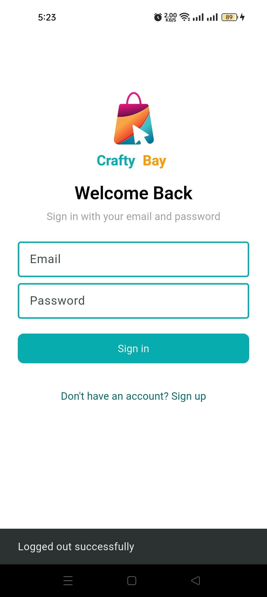 | 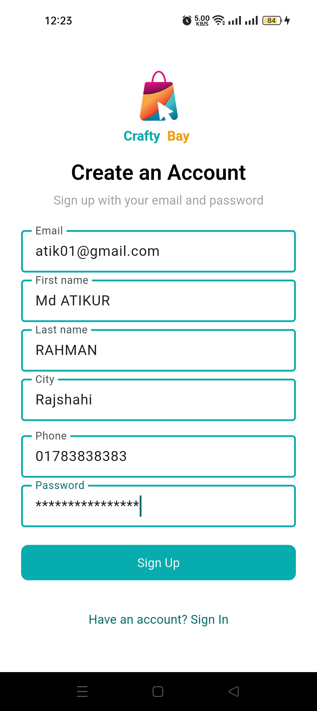 | 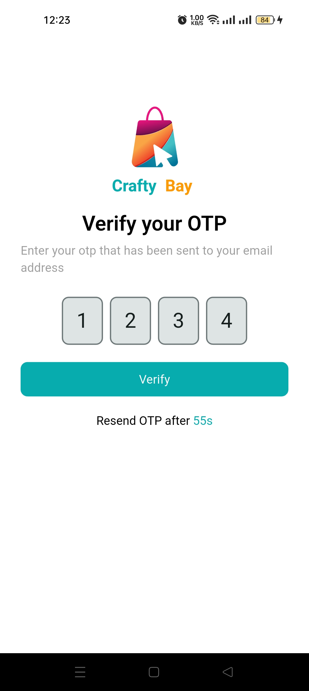 | 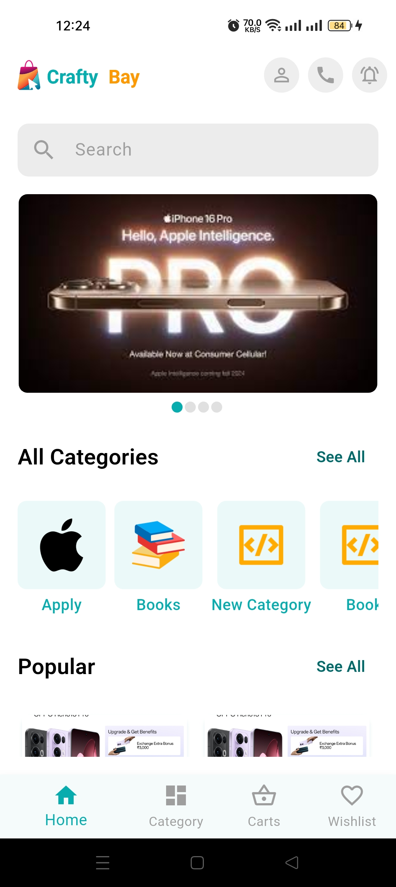 |

| Categories & Sliders | Product Details | Cart Management | Wishlist |
| :---: | :---: | :---: | :---: |
| 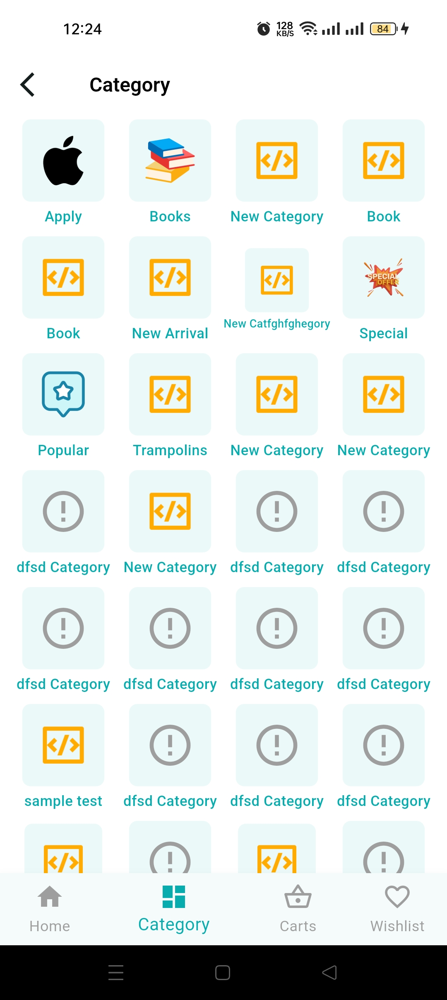 | 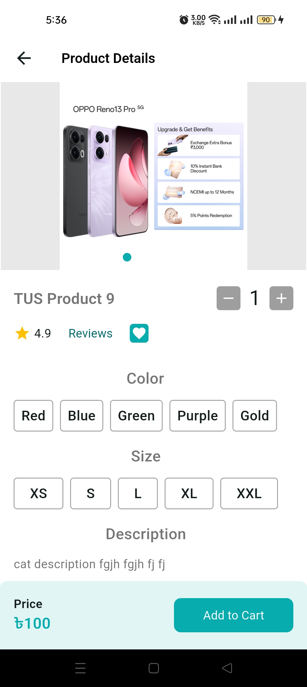 | 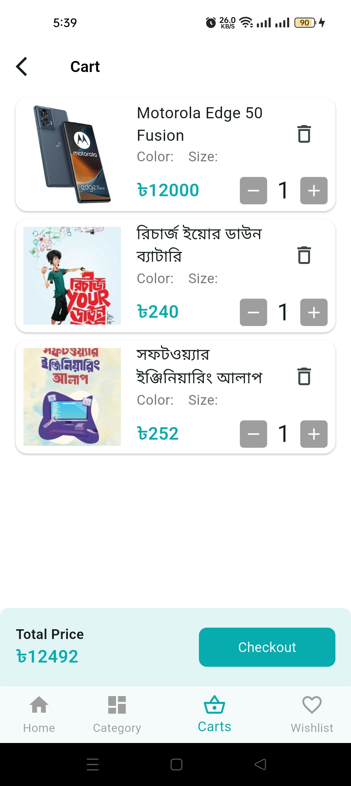 | 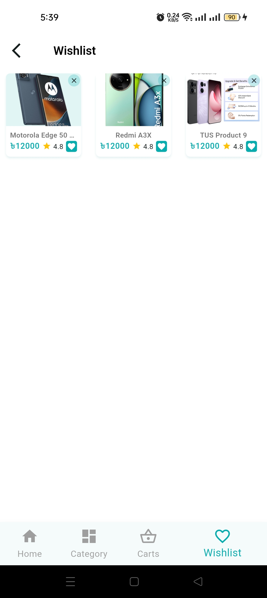 |

| User Profile | Reviews & Ratings | Order Details |
| :---: | :---: | :---: |
| 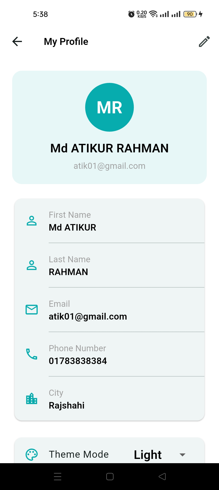 | 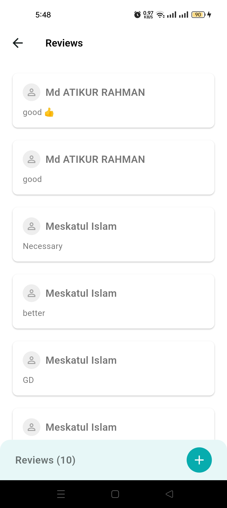 | 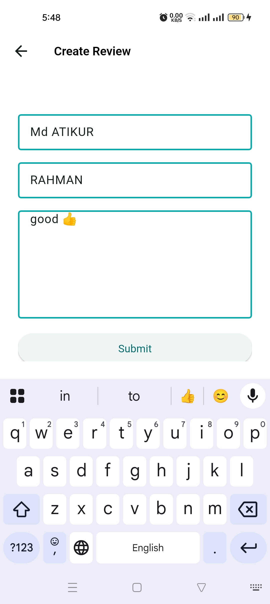 |

---

## ✨ Features

- **🔐 Authentication & User Onboarding**:
  - Email verification with OTP code authentication.
  - Complete profile creation and session persistence using Shared Preferences.
- **🛍️ Product Discovery & Catalog**:
  - Dynamic promotional banner sliders.
  - Category-based product browsing and filtering.
  - Filter products by Remarks (Popular, Special, New Arrival) with intelligent fallback to category listings.
  - Brand-based product discovery.
- **📄 Detailed Product View & Reviews**:
  - Comprehensive product details with color/size selector and image galleries.
  - Customer review list with rating breakdown and ability to add new reviews.
- **🛒 Shopping Cart & Wishlist**:
  - Interactive cart management with quantity controls and real-time total price calculation.
  - One-tap wishlist management to save favorite products.
- **📦 Order Management**:
  - Order tracking, history, and status updates.
- **🌐 Localization & Customization**:
  - Multi-language support (English & Bengali localization via `l10n`).
  - Dynamic Light & Dark theme toggle using custom application themes.
- **🔥 Firebase Integration & Crash Handling**:
  - Real-time error recording via **Firebase Crashlytics**.
  - App usage insights powered by **Firebase Analytics**.

---

## 🏗️ Architecture & Project Structure

CraftyBay adheres to a **Feature-First Layered Architecture** to ensure modularity, maintainability, and scalability.

```text
lib/
├── app/                        # Global app configurations & themes
│   ├── app_colors.dart         # Design color tokens
│   ├── app_theme.dart          # Light/Dark Theme definitions
│   ├── crafty_bay_app.dart     # MaterialApp setup & MultiProvider wrapper
│   ├── routes.dart             # Application routes configuration
│   └── urls.dart               # API Endpoint constants
├── core/                       # Shared network & service layers
│   ├── service/
│   └── network_caller/         # Centralized HTTP request engine
├── features/                   # Feature modules
│   ├── auth/                   # Splash, OTP Verification, Profile Entry
│   ├── brand/                  # Brand list & Brand products
│   ├── cart/                   # Cart state & screens
│   ├── category/               # Categories & Category products
│   ├── home/                   # Main Home Dashboard & Sliders
│   ├── order/                  # Order management
│   ├── products/               # Product details, Reviews, Creation
│   ├── profile/                # User profile screen & settings
│   ├── wishlist/               # Favorite products list
│   └── shared/                 # Reusable cross-feature components
├── l10n/                       # Localization ARB translation files
├── main.dart                   # Application entry point & Firebase init
└── firebase_options.dart       # Firebase platform configurations
```

---

## 🛠️ Tech Stack & Dependencies

| Category | Technology / Package | Description |
| :--- | :--- | :--- |
| **Framework** | [Flutter SDK](https://flutter.dev) (^3.10.0) | Cross-platform mobile application engine |
| **Language** | [Dart](https://dart.dev) | Strongly-typed OOP language |
| **State Management** | [Provider](https://pub.dev/packages/provider) (^6.1.5) | Reactive state management & dependency injection |
| **Networking** | [http](https://pub.dev/packages/http) (^1.6.0) | HTTP REST API client with central network caller |
| **Backend & Cloud** | [Firebase Core](https://pub.dev/packages/firebase_core) | Cloud service integration |
| **Analytics & Crash** | [Firebase Crashlytics](https://pub.dev/packages/firebase_crashlytics), [Analytics](https://pub.dev/packages/firebase_analytics) | Real-time crash reports and analytics |
| **UI Enhancements** | [carousel_slider](https://pub.dev/packages/carousel_slider), [flutter_svg](https://pub.dev/packages/flutter_svg), [pin_code_fields](https://pub.dev/packages/pin_code_fields) | Modern UI components, SVG rendering & PIN inputs |
| **Storage** | [shared_preferences](https://pub.dev/packages/shared_preferences) | Local persistent storage |
| **Localization** | [flutter_localizations](https://api.flutter.dev/flutter/flutter_localizations/flutter_localizations-library.html), `intl` | Internationalization support |

---

## 🚀 Getting Started

### Prerequisites

- **Flutter SDK**: `^3.10.0` or higher ([Installation Guide](https://docs.flutter.dev/get-started/install))
- **Dart SDK**: Compatible with Flutter SDK
- **Android Studio** / **VS Code** with Flutter & Dart extensions
- **Android Device/Emulator** (API level 21+) or **iOS Simulator** (macOS required)

### Installation Steps

1. **Clone the repository**:
   ```bash
   git clone https://github.com/your-username/crafty_bay.git
   cd crafty_bay
   ```

2. **Install project dependencies**:
   ```bash
   flutter pub get
   ```

3. **Generate Localization files**:
   ```bash
   flutter gen-l10n
   ```

4. **Generate Launcher Icons** (Optional):
   ```bash
   dart run flutter_launcher_icons
   ```

5. **Run the Application**:
   ```bash
   flutter run
   ```

---

## 🧪 Testing & Code Quality

Run static analysis to verify code compliance and linting rules:

```bash
flutter analyze
```

Run automated tests:

```bash
flutter test
```

---

## 📄 License

This project is open-source and available under the [MIT License](LICENSE).
